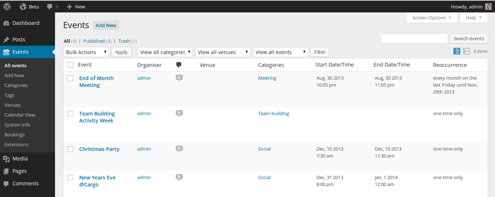
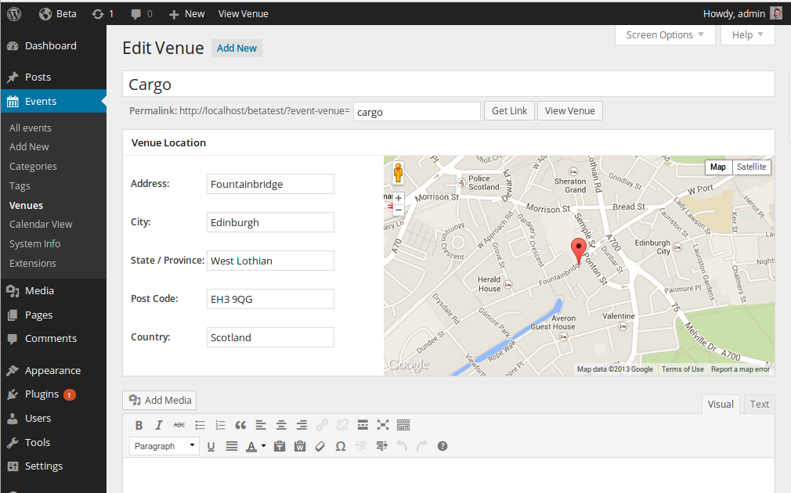
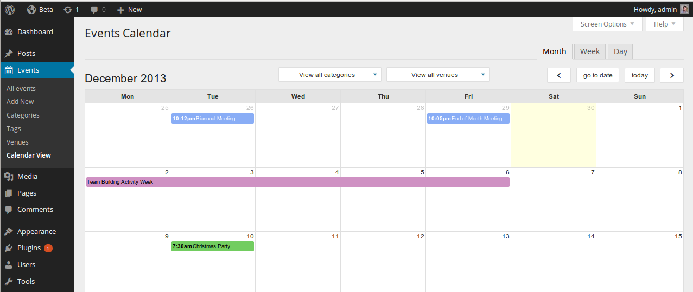
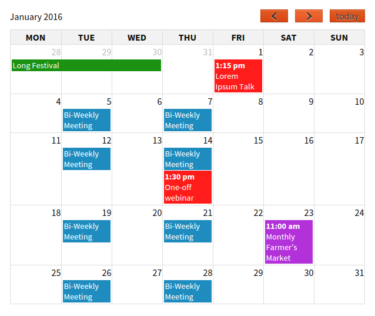
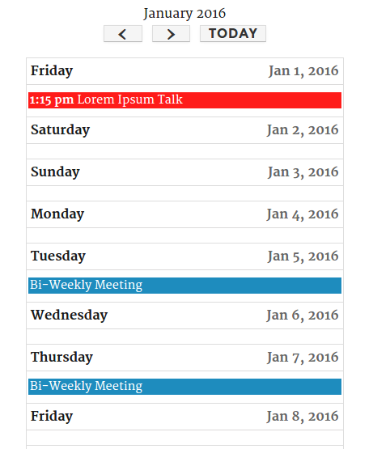

# Event Organiser #
**Contributors:** [stephenharris](https://profiles.wordpress.org/stephenharris)  
**Donate link:** http://www.wp-event-organiser.com/donate  
**Tags:** events, event, event categories, event organizer, events calendar, event management, ical, locations, google map, OpenStreetMap, widget, venues, maps, gigs, shows,  
**Requires at least:** 3.8.0  
**Tested up to:** 5.8.1  
**Stable tag:** {{version}}  
**License:** GPLv3  

Create and maintain events, including complex reoccurring patterns, venue management (with Google Maps or OpenStreetMap), calendars and customisable event lists

## Description ##

Event Organiser adds event management that integrates well with your WordPress site. By using WordPress' in-built 'custom post type', this plug-in allows you to create events that have the same functionality as posts, while adding further features that allow you to manage your events. This includes the possibility of repeating your event according to complex schedules and assign your events to venues. This can all be done through an intuitive user interface, which allows you to view your events in the familiar WordPress list or in a calendar page in the admin area.

[**User Docs**](http://docs.wp-event-organiser.com/)
| [**Function Reference**](http://codex.wp-event-organiser.com/)
| [**Forums**](http://wp-event-organiser.com/forums/)
| [**Demo**](http://wp-event-organiser.com/demo/)
| [**Booking Add-on**](http://wp-event-organiser.com/pro-features?aid=7)

### Available Extensions ###
* [Event Organiser Pro](http://wp-event-organiser.com/pro-features?aid=7)
* [Event Organiser Frontend Submissions](http://wp-event-organiser.com/extensions/event-organiser-frontend-submissions/?aid=7)
* [Discount Codes](http://wp-event-organiser.com/extensions/event-organiser-discount-codes?aid=7)
* [Stripe Gateway](http://wp-event-organiser.com/extensions/event-organiser-stripe?aid=7)
* [Posterboard](https://wordpress.org/plugins/event-organiser-posterboard) (free)
* [CSV export](https://wordpress.org/plugins/event-organiser-csv) (free)
* [iCal Sync](http://wp-event-organiser.com/extensions/event-organiser-ical-sync?aid=7)

A full list of available extensions can be found [here](http://wp-event-organiser.com/extensions/).

### Features ###

### For the user ###

* Create one-time events or recurring events.
* Allows complex recurring patterns for events. You can create events that last an arbitrary time, and repeat over a specified period. Supports complex schedules such as *On the third Tuesday of every fourth month* or *Every month on the 16th*.
* Ability to add or remove specific dates to an event
* **Event functions** available which extend the post functions (e.g. `the_title()`,`get_the_author()`, `the_author()`) to output or return event data (the start date-time, the venue etc). For examples of their use see the [documentation](http://www.wp-event-organiser.com/documentation/function-reference/) or the included template files.
* Create and maintain venues for your events, with **Google maps** support and a fully-featured content editor.
* **Widgets**:
  * Calendar widget - displays a calendar (identical to the standard WordPress Calendar)
  * Event List widget - displays a list of events, with options to specify the number of events, restrict by categories or venues etc.
  * Event Agenda widget
* Year, month and day archive pages
* **Shortcodes**:
  * (full)Calendar, includes optional category & venue filters.
  * (widget) Calendar
  * Event List (similar to Event List widget)
  * Event Agenda (similar to Event Agenda widget)
  * Venue map
  * Subscribe to event feeds
* **Relative date queries** (for example, query events that finished in the last 24 hours, or events starting in the coming week).
* Assign events to categories and tags, and view events by category or tag.
* Colour-coded event categories.
* **Custom permissions** allow to specifiy which roles have the ability to create, edit and delete events or manage venues.
* Venue pages, to view events by venue.
* **Export/import** events to and from ICAL files.
* Delete individual occurrences of events.
* **Public events feed:** allow visitors to subscribe to your events, or a particular venue / category.
* Supports 'pretty permalinks' for event pages, event archives, event category and venue pages.
* (Optionally) automatically delete expired events.

### For the developer ###

* Adds an **event custom post type** that fits naturally into WordPress and allows for all the functionality of 'posts'.
* Respects the template hierarchy. Default templates can be over-ridden by including the appropriately named template files in your theme folder.
* Plug-in **actions and filters** are provided to modify the behaviour of the plug-in ([hook reference](http://www.wp-event-organiser.com/documentation/function-reference/hooks)
* Extensive function API & [documentation](http://codex.wp-event-organiser.com/)
* **Javascript actions and filters** to modify interaction with the calendars and maps
* Provide custom templates for shortcodes, widgets and ICAL export
* Custom metaboxes and meta data support for venues (see [tutorial](http://wp-event-organiser.com/documentation/developers/venue-meta-data-and-metaboxes/)).
* Minified javascript files are used, with the originals provided for ease of developing
* [Booking add-on](http://wp-event-organiser.com/pro-features) available

### Localisation ###

A big thank you to those who have provided translations for Event Organiser. If you wish to help out with translating the plug-in, you can do so [here](http://wp-event-organiser.com/i18n).

* Arabic - Layla, Mohamed Nazir
* Bulgarian - Parvan Voynov
* Catalan - jordioniric, marc.antje
* Chinese - sdsunqian
* Czech - Jan Kupsa
* Croatian - Branimir
* Danish - Intox Studio, Malthe, Morten Lyng
* Dutch  - [Ingrid Ekkers](http://www.247design.nl), Roel
* English (Canada) - GhostToast
* Estonian - Kristjan Roosipuu
* Finnish - Kari Tolonen, Juhani Marttila
* French - [Remy Perona](http://remyperona.fr/), Arnaud
* German - [Martin Grether](http://www.datema.de/) & [Henning Matthaei](http://www.partnerwerk.de/)
* Greek - Vasilis, Panagiotis
* Hebrew (Israel) - heli
* Hungarian - Csaba Erdei
* Icelandic - HrHagedorn
* Indonesian - Daniel Tampubolon
* Italian - Emilio Frusciante, Pio Muto, Daniele Piccoli
* Japanese - ogawa, tkj, takeshi terai, haya.
* Latvian - Kristaps
* Lithuaniun - Stephan Siegi
* Macedonian - Aleksandar
* Norwegian - Erlend Birkedal
* Norweign (Bokmål) - DagC
* Persian (Iran, Islamic Republic of) -
* Polish - [Bartosz Arendt](http://digitalfactory.pl/)
* Portuguese (Brazil) - [Rafael Wahasugui](http://www.twitter.com/rafawhs), rafaelkvidal
* Portuguese (Portugal) - Emanuel Teixeira
* Romanian - raduanastasedev
* Russian - [Sergei](www.vortexinter.ru)
* Slovak - ViRPo
* Slovenian - Matej
* Spanish (Spain)- Joseba Sanchez, jagarre, jelena kovacevic, courtesy of [WebHostingHub](http://www.webhostinghub.com/)
* Spanish (Peru) - Pedro Valverde
* Swedish - Sofia Bråvander, Urban Norlander
* Thai - Nibhon, Wuttichai Songprapai
* Turkish - Gökhan DAMGACI
* Ukranian - Максим Кобєлєв

## Installation ##

Installation is standard and straight forward.

1. Upload `event-organiser` folder (and all it's contents!) to the `/wp-content/plugins/` directory
1. Activate the plugin through the 'Plugins' menu in WordPress
1. Check Settings > Event Organiser

## Frequently Asked Questions ##

### How to create an event ###

Events behave very similarly to standard posts. To create a event, select the 'Add New' submenu from 'Events' menu. The chief difference between events and post is the 'Event Details' metabox which sets the date and venue data related to the event.

You can also add events in the Calendar view in a manner similiar to Google Calendar. By selecting one (or multiple) days (in month mode) or times (in week/day mode) you can create an event that spans the selected period.

### The Event Pages Don't Look Right ###

Unfortunately its impossible for the default templates to work with *every* theme. Occasionally, they simply don't work well with a given theme - the event content might not appear right, or the sidebar might seem displaced. The solution is to edit the default templates to fit in with your theme (you can use your theme's own templates as a guideline). [You can find more information here](http://wp-event-organiser.com/documentation/editing-the-templates/)

### How do I display events? ###

Events are automatically displayed on the events page: try `www.your-wordpress-site.com/?post_type=event` (If you have permalinks enabled these will have 'prettier' versions). Similarly there are venue and event category pages. Each of these pages have their own associated template which are present in the **template** sub-directory of the Event Organiser plug-in folder. To override the default templates, simply create the appropriately named files in your theme directory.

**Widgets**
The plug-in also provides the following widgets ([see widget documentation](http://wp-event-organiser.com/documentation/widgets/)):

* **Event list** - list events allows with options to filter by venue, categories and dates.
* **Calendar** - display a calendar, similiar to the WordPress calendar, that displays your events.
* **Agenda** - displays your events in a list grouped by date and navigated with AJAX.

**Shortcodes**
Among others, the plug-in also provides the following shortcodes ([see shortcode documentation](http://wp-event-organiser.com/documentation/shortcodes/)):

* **Event list & Widget Calendar** - shortcode versions of their widget counterparts.
* **Full calendar** - a calendar, similiar to the admin calendar, with optional month, week and day views and category and venue filters

**Template Functions**
Finally, the plug-in provides a function `eo_get_events()` which is similiar to WordPress' `get_posts()`. It returns an array of post objects (where the posts are events), and this can be used to display events through editing your theme. The usual WordPress functions for display associated information (author, title etc) are still available to you, and the plug-in provides a similar set of functions to display event related data (dates, venues etc). [See the documentation for more information](http://www.wp-event-organiser.com/documentation/function-reference/).

### The full calendar doesn't display any events ###

The calendar should display all published events. If you find the calendar doesn't appear this is usually caused by the theme you are using, and is verifiable by temporarily switching to the TwentyEleven theme. If the theme is the cause this is normally because:

* The theme de-registers the jQuery / jQuery UI shipped with WordPress and registers an outdated version
* The theme does not call [`wp_footer`](https://codex.wordpress.org/Function_Reference/wp_footer) in the footer

If the calendar *does* appear, but gets stuck loading, the cause is usually the AJAX response. If your site is in 'debug' mode - this can be due to error messages from other plug-ins being printed. You can view the AJAX response in your browsers console (E.g. Firefox's firebug or Chrome's dev tools). If you are still unable to determine the cause of the problem, or how to fix, please use the plug-in forums with a link to your site and I'll take a look.

### I cannot navigate between months on the widget calendar ###

If clicking on the 'next' month causes the page to reload - the javascript has not been loaded. This is usually because the theme does not call [`wp_footer`](https://codex.wordpress.org/Function_Reference/wp_footer) in the footer.

If the calendar simply does not respond this is usually because your theme does not allow widgets to add their own ID and classes. Somewhere in the theme folder your theme will make use of `register_sidebar()` (probably in `functions.php`. It should look something like:

    register_sidebar(array(
      'name' => __( 'Side bar name' ),
      'id' => 'sidebar-id',
      'description' => __( 'Widget area description' ),
      'before_title' => '<h1>',
      'after_title' => '</h1>',
      'before_widget' => '
',
      'after_widget' => '
',
    ));

Notice the `%1$s` and `%2$s` in the `before_widget` argument. These allow the widget to add their own ID and classes to the widget. If your theme does not use `class="widget %2$s"` (they should!) the month navigation for the widget calendar will not work.

If you are still unable to determine the cause of the problem, or how to fix, please use the plug-in forums with a link to your site and I'll take a look.

### What ShortCodes are available? ###

Event Organiser provides the following shortcodes:

* `[eo_events]`  - displays a list of events allows with options to filter by venue, categories and dates.
* `[eo_calendar]`  - displays a widget-calendar of your events, similiar to WordPress' calendar, and navigated with AJAX.
* `[eo_fullcalendar]`  - displays a calendar, similiar to the admin calendar, with optional month, week and day views and category and venue filters.
* `[eo_venue_map]` - displays a Google map of the current venue, or of a particular venue given as an attribute.
* `[eo_subscribe]` - wraps the content in a link which allows visitors to subscribe to your events; there are two types: 'Google' and 'Webcal'.

More information on shortcodes is [available here](http://wp-event-organiser.com/documentation/shortcodes/)

## Screenshots ##

### 1. Event admin screen ###

### 2. Venue admin screen ###

### 3. Event details metabox, showing the full reoccurrence options and venue selection ###

### 4. Venue editing screen, with Google Maps ###

### 5. Calendar View screen ###

### 6. Calendar shortcode (using TwentyThirteen) ###

### 7. Calendar shortcode when viewed on a mobile device (using TwentyFourteen) ###

### 8. Events list (using TwentySixteen) ###

## Changelog ##

### 3.10.8 - 13th October 2021 ###
* bugfix: Close open tooltip windows when opening tooltip..

### 3.10.7 - 11th June 2021 ###
* bugfix: Fixed bug with license keys not saving on multisite installations.

### 3.10.6 - 17th May 2021 ###
* bugfix: Fix bug with Open Street Map & selecting 'no venue'

### 3.10.5 - 7th March 2021 ###
* bugfix: Replace deprecated jQuery methods

### 3.10.4 - 19th January 2021 ###
* bugfix: Fixed week/day calendar views broken in WP 5.6
* bugfix: Fixed some jquery-migrate deprecation notices

### 3.10.3 - 15th January 2021 ###
* bugfix: Fixed jQuery errors with WordPress 5.6
* bugfix: Fixed styling regressions

### 3.10.2 - 13th September 2020 ###
* bugfix: Fixed all-day toggle not working with WordPress 5.5

### 3.10.1 - 14th August 2020 ###
* bugfix: Fixed iCal feeds being treated as comment feeds

### 3.10.0 - 22nd July 2020 ###
* feature: Extended support for RECURRENCE-ID in iCal calendards
* bugfix: Ensure translated screen help text is escaped
* bugfix: Replace instances of curly braces for array access (deprecated PHP 7). 

### 3.9.1 - 28th May 2020 ###
* bugfix: Fixed bug where venue can't be changed if maps are disabled
* feature: Added additonal methods to the maps adapter API

### 3.9.0 - 8th January 2020 ###
* feature: Added option to disable venue maps
* bugfix: Ensure latitude/longtitude co-ordinates are cast as floats

### 3.8.6 - 18th November 2019 ###
* bugfix: Removed call to is_feed(), uses $query->is_feed() instead. Fixes potential warning logged

### 3.8.5 - 7th November 2019 ###
* bugfix: Fixed missing Leaflet files for openstreetmap

### 3.8.4 - 5th November 2019 ###
* bugfix: Fixed inline editing event looses venue selection

### 3.8.3 - 31st August 2019 ###
* bugfix: Fixed 'Feed not found' when importing a feed with a Byte Order Mark.

### 3.8.2 - 6th August 2019 ###
* bugfix: Restored PHP 5.2 compatability

### 3.8.1 - 26th July 2019 ###
* Bumped tested up-to version
* bugfix: Fixed bug where leaflet map appeared above datepicker in the event edit screen

### 3.8.0 - 15th July 2019 ###
* feature: Added `eventorganiser_ical_location` filter
* feature: Added `eventorganiser_ical_summary` filter
* bugfix: Fixed max zoom for leaflet
* bugfix: Fixed recurrence notice being removed by 'hide admin notices' plugin
* bugfix: Fixed bug where `[eo_fullcalendar]` shortcode would not display terms in the dropdown filter if they were surrounded by space, e.g. `[eo_fullcalendar event_category="foo, bar"]`

### 3.7.6 - 6th March 2019 ###
* bugfix: Fixed missing translations
* bugfix: Fix tags and categories not appearing in Gutenberg 

### 3.7.5 - 1st March 2019 ###
* feature: Added eventorganiser_pre_insert_venue filter
* bugfix: Use case-sensitive constants for PHP 7.3 [#454](https://github.com/stephenharris/Event-Organiser/issues/454)
* bugfix: Fix issue if event categories are invalid [#455](https://github.com/stephenharris/Event-Organiser/issues/455)
* bugfix: Fix user_events option for calendar not working
* bugfix: Ensure table names are reigstered before removing tables. Fixes [#444](https://github.com/stephenharris/Event-Organiser/issues/444)
* bugfix: Fix warning for PHP 7+ where string is passed, not integer
* bugfix: Fix typo

### 3.7.4 - 26th August 2018 ###
* bugfix: Fix bug with venue map shortcode when used without attributes

### 3.7.3 - 13th July 2018 ###
* bugfix: Fix Google Maps API key notice appearing when Open Street Maps is selected
* bugfix: Corrected spelling error in venue arguments ("longtitude" corrected to "longitude")

### 3.7.2 - 8th June 2018 ###
* bugfix: Fixed maps bug which affected users with Yoast's SEO Plugin installed
* bugfix: Replaced data-vocabulary.org with schema.org
* bugfix: Fixed higher-priority template being overridden by lower priority template in
  `eo_locate_template()` when multiple template names are given. See [#434](https://github.com/stephenharris/Event-Organiser/issues/434)

### 3.7.1 - 31st May 2018 ###
* bugfix: fixed admin calendar modal appearing behind overlay
* bugfix: fixed venues with apostrophes not appearing in the venue search/autocomplete.

### 3.7.0 - 25th May 2018 ###
* Added support for OpenStreetMap. New installations default to OpenStreetMap.

### 3.6.5 3rd April 2018 ###

* bugfix: Only use date ordinal suffix (st,nd,rd,th) if the site's date format setting includes it

### 3.6.4 26th March 2018

* bugfix: Addressed issue where grouping occurrences might error depending on MySQL configuration. Fixes [#432](https://github.com/stephenharris/Event-Organiser/issues/432)
###
### 3.6.3 6th March 2018

* bugfix: Fixed bug with grouping occurrences, effecting some MySQL versions. Fixes [#430](https://github.com/stephenharris/Event-Organiser/issues/430)
###
### 3.6.2 5th January 2018

* bugfix: Fixed reference error in calendar shortcode introduced in 3.6.1
###
### 3.6.1 4th January 2018

* bugfix: Bug where static value is used for calendar breakpoint on initial load
* bugfix: Ensure venue tooltip is moved to fit within viewport
* bugfix: Bug where clicking on the venue tooltip could cause the map to overflow the container
###
### 3.6.0 25th November 2017

* added: Ability to specify multiple event authors (organiser) in the fullcalendar author/author_name attribute###
  by using a comma seperate lised e.g: [eo_fullcalendar author="1,2"]
* bugfix: The "organiser" full calendar filter only displays users included in the author/author_name attribute
  if supplied.
* bugfix: Occurrences which have changed time still appear in the include/excludes datepicker
* bugfix: iCal feed will display correct DSTART & DTEND values even when the initial occurrence is excluded from
  the query driving the feed.
* changed: The admin calendar week/day views display 15-minute intervals. If dragging of occurrences is enabled
  this can be done in 5 minute intervals.

### 3.5.1 14th November 2017

* Fix bug where multiple filters are used in fullcalendar shortcode, seperated by a comma
###
### 3.5.0 8th November 2017

* Added 'organiser' option to calendar shortcode's headerLeft/headerCenter/headerRight attributes - allows
  filting of the event calendar by event organiser (author).
* Improved effeciency of calendar page load time by lazy loading required data
* Updated French and Dutch translations
* Tested up to 4.9.0-beta-4

###
### 3.4.1 18th October 2017

* Tested up to 4.9.0-beta-2
* Fixed a bug with the calculation of long occurrences
* Updated Czech translation
###
### 3.4.0 25th September 2017

* Tested up to 4.8.2###
* added: `weeknumbers` attribute for the calendar shortcode: `[eo_fullcalendar weeknumbers=true]`

### 3.3.0 12th September 2017

* added: `%event_range{date-format}{time-format}%` placeholder for the event list shortcode / widget
* added: `%event_organiser%` placeholder for the event list shortcode / widget
* added: `eventorganiser_google_maps_url` hook
* updated: Spanish, Finish and Italian translations
* bugfix: private events authored by the current user are now visible in the admin calendar
* bugfix: Fix casing in 'All events'
* bugfix: Fix bug in event list widget settings: `group_occurrences` checkbox is not checked, even when enabled.

###
### 3.2.0 23rd August 2017
* Updated 'Tested up to' version (WordPress 4.8.1)
* Update Czech, Indonesian, French, Japanese, Dutch, Portuguese,
  Norwegian, Slovenian and Swedish.
* Default event page names are now filterable via `eventorganiser_event_properties`.
* Remove X-WR-CALNAME from iCal feed for single event feeds. See [#413](https://github.com/stephenharris/Event-Organiser/issues/413).
* Fixes errors if event-category tax is disabled. See [#414](https://github.com/stephenharris/Event-Organiser/issues/414)
* Fixes mark-up error in calendar widget: tbody must occur before tfoot
###
### 3.1.10 - 8th July 2017
* Updated 'Tested up to' version (WordPress 4.8)
* Updated Afrikaan, Catalan, Croatian, Czech, Dutch, French, German, Greek,
  Hungarian, Portuguese, Russian, Slovenian, Spanish and Turkish translations.
###
### 3.1.9 - 31st March 2017
* Removed development tool
* Updated French, Italian and Japanese translations
###
### 3.1.8 - 30th March 2017

* Handle 767 byte index size limit in MySQL. See [#404](https://github.com/stephenharris/Event-Organiser/issues/404)
* Fix handling of ampersands in the iCal feed
###
### 3.1.7 - 23rd December 2016
* bugfix: Remove icon was not visible when editing galleries on the event admin page
###
### 3.1.6 - 11th November 2016
 * Fix bug causing edit event admin page to link to the settings page.
 * Fix bug in `eo_get_current_occurrence_of()`
 * Ensure `occurrence_id` value returned by `eo_get_next_occurrence_of()` is an integer not a string.
###
### 3.1.5 - 2nd November 2016 ###
* bugfix: Fixed conflict, affecting widget the calendar, with some tranlsation plugins. This resulted in not being able to naviage through the calendar.
* bugfix: Fixed inline documentation
* bugfix: Fixed ` ` tag being used as a closing tag

### 3.1.4 - 9th September 2016 ###
* Tested up to 4.6.1
* bugfix: In the iCal field don't change the BYDAY property when a city is used as a timezone (i.e. instead of a UTC offset). Fixes [#376](https://github.com/stephenharris/Event-Organiser/issues/376)

### 3.1.3 - 23rd July 2016 ###
* bugfix: Fixed tranlsation (.mo files)
* bugfix: Fixed image files
* enhancement: Updated translations

### 3.1.2 - 20th July 2016 ###
* enhancement: Uses `eo_get_permalink()` rather than `get_permalink()`` in default templates.
* bugfix: Fixes private events not displayed in the calendar widget for those who can view private events
* bugfix: Fixes warnings in calendar widget settings
* bugfix: Fixes invalid HTML mark-up in widget settings. Ref #370
* bugfix: Fixes an edge case bug where the iCal feed errored
* bugfix: Fixes a typo in google maps help text

### 3.1.1 - 8th July 2016 ###
* bugfix: Allows Google Maps API to be used via a setting or constant. Please see http://wp-event-organiser.com/blog/announcements/google-maps-now-requires-api-key/ for details [#365](https://github.com/stephenharris/Event-Organiser/pull/365)
* bugfix: Fixes bug where deleting all the occurrences of an event via the admin calendar does not properly delete the event. [#367](https://github.com/stephenharris/Event-Organiser/pull/367)
* bugfix: Sanitize hex codes for event category colours.
* bugfix: Fixed bug where the subscribe to calendar (in Google) shortcode did not work on sites using SSL certificates. [#328](https://github.com/stephenharris/Event-Organiser/issues/328)
* enhancement: Refactor event render filter for the calendar so that it always fires [#366](https://github.com/stephenharris/Event-Organiser/pull/366)
* bugfix: Fixes a bug where events without any dates did not appear in the Events admin. [#367](https://github.com/stephenharris/Event-Organiser/pull/367)

### 3.1.0 - 23rd May 2016 ###
* enhancement: Improved performance when grouping by event series
* enhancement: Added `event_series` attribute for calendar shortcode. Display only occurrences in Event with ID5: `[eo_fullcalendar event_series="5"]`
* enhancement: Add event-category / event-url query parameters to the URLs on the calendar widgt if filtering by category / venue.
* enhancement: iCal feeds now include the featured image
* enhancement: Added `eventorganiser_indefinitely_recurring_event_last_date` filter to change 'recur until date' for indefinitely recurring events imported from an iCal feed.
* enhancement: Added `eventorganiser_metabox_after_core_fields` action after core fields in Event metabox
* enhancement: Add setting to configure calendar shortcode's mobile breakpoint
* enhancement: Calling `eo_format_datetime()` with a non DateTime object throws an exception
* bugfix: Fix a bug with formatting date-range when two tokens look the same (e.g. day of the week) bug refer to different dates. (See [#359](https://github.com/stephenharris/Event-Organiser/pull/359))
* bugfix: Improved a11y of venue address metabox
* bugfix: Improve a11y of notices and remove title attribute #323
* bugfix: Removed unnecessary title attributes, and 'bookmark' link from templates and elsewhere
* bugfix: Fixed bug were uppercase meridian was being removed for languages which don't have a translation (should instead retain the English default, as is the case with lowercase meridian). Adds tests
* bugfix: Double quotes now stripped from the ORGANISER CN parameter in iCal feeds
* bugfix: Remove date from venue page title when viewing events in a venue in given year/month or on a given date
* bugfix: Fixed notice markup containing incorrect closing anchor tag

### 3.0.5 - 31st March 2016 ###
* bugfix: Compatible with WordPress 4.5
* bugfix: Fixed bug which occurs in firefox when using a single digit for the date/month attribute of the calendar shortcode
* bugfix: Used alternative 'Mustache' style syntax for the agenda widget to prevent conflicts with servers with ASP tags enabled.
* bugfix: Used get_the_title rather than post_title property in the calendar widget
* bugfix: Disabled plug-in's front-end css if theme support is enabled.
* bugfix: Fixed error in the agenda widget if there are no events to display
* bugfix: Fixed 'undefined variable' warning in eo_get_permalink

### 3.0.4 - 3rd March 2016 ###
* bugfix: Fixed venue and organiser filters were not being applied for calendar shortcode
* bugfix: Fixed 404 errors with category/venue dropdown widget

### 3.0.3 - 24th Feburary 2016 ###

* enhancement: Removed the year from the list view
* bugfix: Fixed ordering of terms in the Events admin page filters
* bugfix: Restore backwards compatability for custom templates using the 'upcoming dates' list show more/less feature
* bugfix: Fixed venue dropdown not filtering the (frontend)calendar
* bugfix: Fixed incorrect class name in the 'upcoming dates' list show more/less links
* bugfix: Fixed timezone warning not dismissable.
* bugfix: Fixed typo in stylesheet

### 3.0.2 - 12th Feburary 2016 ###

* enhancement: Clicking the down array in the venue selection field shows all venues. Limit of suggested venues while searching  venues in search suggestion increased to 10.
* enhancement: Updated Dutch translation
* bugfix: Fixed and issue with some date formats (such as 'T', 'Z') not rendering correctly on the calendar. Not all formats are supported.
* bugfix: Ensured the agenda widget does display bullet points. This fixes compatability issues with some themes.
* bugfix: Fixed warning when quick editing an event
* bugfix: Restored missing template field in the event list widget
* bugfix: Fixed basic week/day buttons not hidden when in responsive list view.
* bugfix: Fixed calendar not highlighting the current day.

### 3.0.1 - 4th February 2016 ###

* bugfix: Fixed incorrect 'No Venue' label in venue selection when editing an event
* bugfix: Update languages
* bugfix: Addressed some text inconsistancies and typos (See [#329](https://github.com/stephenharris/Event-Organiser/pull/329), [#330](https://github.com/stephenharris/Event-Organiser/pull/330), [#331](https://github.com/stephenharris/Event-Organiser/pull/331), [#333](https://github.com/stephenharris/Event-Organiser/pull/333))
* bugfix: Fixed bug with agenda widget not translating dates.
* bugfix: Removed inline styles from the front-end and moved to stylesheet.
* bugfix: Fixed bug where agenda widget was not linking to event (when 'add to Google' is disabled)
* bugfix: Agenda widget now opens on todays date if it has an event
* bugfix: Fixed subscribe shortcode when specfying a particular category/venue.

### 3.0.0 - 29th January 2016 ###

**Event Organiser now requires WordPress 3.8.0+ or better**

fullCalendar

* feature: fullCalendar is now responsive, and collapses to a list on mobile view. This can be disabled with `[eo_fullcalendar responsive=0]`
* feature: Adds `nextDayThreshold` option. A multi-day event must finish after this time for it appear on that day on the calendar. Default '06:00:00' (6am)
* feature: You can enable a more compact calendar view, where an event will occupy only one line in the calendar and long event titles are truncated. This can be enabled as follows: `[eo_fullcalendar compact=true]`
* feature: Improved, and minimalist styling for the calendar, which makes it easier for themes to set the calendar styling.
* feature: fullCalendar key attribute can now take the value 'top' or 'bottom', e.g. `[eo_fullcalendar key="bottom"]` to configure the location of the category colour key.
* feature: Adds `aspectratio` attribute to configure the aspect ratio (height/width) of the fullCalendar. Defaults to auto resizing.
* feature: You can now specify which days appear on fullCalendar shortcode (day & week views): `[eo_fullcalendar showDays="MO,WE,TH,SU"]`
* feature: The fullCalendar library has been upgraded to v2.2.7
* feature: Adds `slotDuration` option, to specify the duration of time slots in the agenda views, default '00:30:00' (30 minutes)
* feature: date/time ranges in calendar titles/axis are now done automatically.
* change: Use `defaultdate` attribute (yyyy-mm-dd) instead of year/month/date attributes to specify an opening date for the calendar
* bugfix: Event categories in the calendar filter now appear in alphabetical order

API

* change: Removed support for deprecated API (Deprecated in 1.5.6, Sep 2012).
* change: `eo_event_venue_dropdown()` is deprecated (though still useable). It is recommended that you use use `eo_taxonomy_dropdown()` instead
* feature: Introduced `eo_format_event_occurrence()`: which will format the date(time) (range, where appropriate) of the event occurrence. E.g. a one day event may appear as 28th November 2pm-3pm, and a two-day all-day event may appear as 28-29th November. The resulting date depends on the date/time format options, and whether the event is multi-day and whether is all-day.

Google map

* Added js-hook `eventorganiser.google_map_loaded`
* Venue map function and shortcode now support `minzoom` and `maxzoom` properties

Theme compatability

* feature: A 'theme compatability' mode has been introduced to improve compatability with themes. This can be enabled in Settings > Event Organiser > General

Templates

* feature: Added `eo_format_event_occurrence()`, `eo_format_datetime_range()` functions to help format event dates and ranges
* feature: dateformats in event templates now use the date format settings
* feature: Added `eventorganiser_stylesheet_src` and `eventorganiser_stylesheet_src_{handle}` filters to filter plug-in stylesheets locations. This allows for themes to map plug-in stylesheets to their own stylesheets.
* feature: Added `eo_enqueue_style()` function, which filters the handle of front-facing CSS files with `eventorganiser_stylesheet_handle_{handle}`. This allows themes/plugins to map a CSS file to a different one.
* change: Removed generic `entry-meta` class from `event-meta-event-single.php` template as this was causing theme compatability issues
* change: Events pages (events, venue, category tag pages) now display the event's start and end time as a range, e.g. 20th January 2016, 8pm-9pm
* change: Single event page, upcoming dates template can now be used on templates with multiple events
* change: HTML classes added for the upcoming dates on the single event page for themes

iCal feed

* feature: The iCal importer is more forgiving when importing incorrectly formatted iCal feeds
* feature: When importing a feed, the DURATION attribute is now supported
* bugfix: Fixes bug with way events without a DTEND specified were interpretted.
* bugfix: Event dates are not converted to Site's timezone defined in VTIMEZONE (if php 5.3+)

Widget

* change: Agenda widget 'day' mode it behaves like week/month mode and displays only one day at a time
* feature: Event list widget now allows you to list events in certain scopes (e.g. past events, future events, running events, events on today). Custom 'scopes' can be registered with the `eventorganiser_query_scope` filter.

General

* feature: improved performance, particularly for sites with long recurring events or large number of venues
* feature: Added `eventorganiser_timezone` to filter the timezone
* feature: improved support for UTC-offset timezones, but it is **strongly** recommended you chose a city
* bufix: Fixes bug where quick editing will cause event start and end cells to disappear

Accessibility
This is an ongoing process, and any bug reports, feature suggestions and pull requests are welcome in this respect.

* feature: Added a Keyboard shortcuts modal (shift + ?) added (admin calendar page)
* bugfix: Edit event metabox no longer uses a tabular mark-up. Missing label/description mark-up is added, as well as other minor improvements to the markup.
* bugfix: The timepicker is now keyboard accessible
* bugfix: Focus state is now clearer on the date & time pickers
* bugfix: Modals on the admin calendar page are keyboard friendly
* bugfix: Mark-up for the admin calendar tabs have been improved
* bugfix: Screen reader text added to events in the fullcalendar and calendar header made an aria-live region
* bugfix: Improved keyboard accessibility of venue selection on the edit event and calendar screen

### 2.13.7 - 9th December 2015 ###
* Fixes a bug with the event list widgets on WordPress 4.4
* Ensures categories in the category fullCalendar shortcode are listed alphabetically
* Replaces deprecated `.below-h2` with `.inline` notice classes
* Updated translations and Lithuaniun

### 2.13.6 - 9th August 2015 ###
* Fixes incompatability with WordPress 4.3 on venue admin screen

### 2.13.5 - 25th July 2015 ###
* Register database tables early
* Fix bug where 'schedule_last' is used instead of 'until' in parsing iCal feed.

### 2.13.4 - 13th June 2015 ###
* Correct escaped characters in time format not being displayed as literal text. Fixes [#273](https://github.com/stephenharris/Event-Organiser/issues/273).

### 2.13.3 - 2nd June 2015 ###
* Fixed incomptability with WordPress 3.4. **Please note that from Event Organiser 3.0.0 onwards, the minimum requirement is being increased to WordPress 3.8**

### 2.13.2 - 23rd May 2015 ###
* Fixed a bug with the drop-down venue/category filters on the events admin screen with WordPress 4.2.
* Fixed issue with google map when selecting a venue on the event admin screen.  Props to @r-a-y.
* The times of newly created events are now rounded (forward) to the half hour. Props to @r-a-y.
* Reoccurence label is changed from 'once' to 'none'. Props to @r-a-y.
* Updated translations.

### 2.13.1 - 7th May 2015 ###
* Fixes bug where use of `%event_duration%` tag modifies end date
* Fixes bug where `schedule_last` is set to 'false'. (Fixes conflict with FES)

### 2.13.0 - 1st May 2015 ###
* Added `eo_get_the_occurrence_id()` for use 'inside the Loop'
* Added `eo_get_permalink()` for use by themes/extensions
* Added filter event calendar query: `eventorganiser_fullcalendar_query`
* Added `eventorganiser_additional_event_meta` action
* Added	`eventorganiser_updated_event` hook
* `schedule_last` argument for `eo_insert_event()` and `eo_update_event()` deprecated in favour of `until`. (`schedule_last` is still
  supported)
* Fixed bug where including/excluding dates may change 'until' recurrence date.
* Fixed bug with importing included/excluded dates in 'foreign' timezone to site timezone
* Bump fullCalendar CSS to 1.6.4 inline with fullcalendar.js. Fixes issue with event overlap in week view
* Fix bug in iCal parsing with feeds containing weekly events without a byday component to the RRule

### 2.12.5 - 21st April 2015 ###
* Fixes XSS vulnerability
* Fixes a bug with editing an event date/time after including additional dates.
* Fixes warnings produced by `eo_break_occurrence()`

### 2.12.4 - 19th March 2015 ###
* Fixes bug with incorrect "Invalid datetime" errors when parsing iCal exdate or rdate dates
* Decode HTML entities for X-ALT-DESC

### 2.12.3 - 13th March 2015 ###
* Fixes bug with iCal parser not correctly handling excluded date-times (bug introduced 2.12.0)
* Fixes bug with validating iCal date (as opposed to date-time).

### 2.12.2 - 10th March 2015 ###
* Fixes conflict with ACF on event admin pages
* Fixes fatal error on events pages when displaying event tag (bug introduced 2.12.1).
* Fixes `eo_get_event_meta_list()` for use outside the loop.
* Uses taxonomy labels array for category drop-dropdown labels.
* Updates Romanian & Slovak translations.

### 2.12.1 - 2nd March 2015 ###
* Fix bug which disabled adding events via the admin calendar
* Fixed typo with enabling beta feature of changing an occurrence's time via the admin calendar
* Added php 5.2 to Travis CI tests

### 2.12.0 - 20th February 2015 ###
*You are strongly recommended to update to 2.12.0 before updating to **WordPress 4.2** (to be released).
Please see this [post](http://wp-event-organiser.com/blog/announcements/event-organiser-wordpress-4-2)*

* Includes fix for WordPress 4.2 "term splitting".
* Removes obsolete event update checks. Fixes [#241](https://github.com/stephenharris/Event-Organiser/issues/241).
* Adds support for "author" and "author_name" attributes for fullCalendar to display a user's events.
* Adds support for "event_tag" attribute for fullCalendar to display a events with particular tag(s).
* Fixes bug with iCal feed not converting HTML entities for summary/description.
* Improve resonsiveness of venue admin page. Fixes [#236](https://github.com/stephenharris/Event-Organiser/issues/236).
* Fixes bug with event ID not always set for eventorganiser_get_the_start/end filters.
* Remove tabindex attribute from venue admin page.
* Replaces `get_the_permalink()` with `get_permalink()` in iCal feed.
* Adds fix for themes adding CSS transition to fullCalendar.
* Ensures dates are populated when duplicating events with Duplicate Post plug-in. Fixes [#242](https://github.com/stephenharris/Event-Organiser/issues/242).
* Fixes bug with long list of (unscrollable) venues overflowing modal on admin calendar page.
* Allows post_date and post_date_gmt keys in eo_update/insert_event.

### 2.11.1 - 28th January 2015 ###
* Fixes UI issue with adding/removing occurences
* Improves highlight of "active" components
* Sets max-width of venue/category drop-downs so long venue/category names don't break the admin calendar layout

### 2.11.0 - 24th January 2015 ###
* Update jQuery UI stylesheet
* Removed support for old classic (blue) WordPress admin
* Adds a fix for fullcalendar with themes setting max-width of links
* Add 'sanity check' for datetime instances in event class function
* Add comment_status & context to eo_insert_event / eo_update_event post data
* Updated Spanish, French, Latvian, Swedish & Turkish translations.
* Added Macedonian translation.

### 2.10.0 - 22nd December 2014 ###
* Tested against WordPress 4.1
* Allow google map styles to be set via API
* Added `eventorganiser_venue_map_options` filter
* Support RTL languages (added stylesheet)
* Added `eventorganiser_ical_property_{property_lowercased}` action
* Added `eventorganiser_pre_ical_property_{property_lowercased}` filter
* Added venue admin page hook for `<form>` tag.
* Fixed incorrect text domain.
* Fixed 'color' property name typo on frontend.js fullCalendar

### 2.9.2 - 31st October 2014 ###
* Fixes plug-in textarea options, where saved value does not appear.

### 2.9.1 - 14th October 2014 ###
* Updates translations including Portugese (Brazil), Hebrew and French.
* Handles duplicate UID errors (in iCal feeds) arising from edited occurrences.
* Fixes conflict with themes where the .eo_widget_calendar class is not added to widget calendar widgets.
* Add data attribute support for checkbox/textarea functions
* Adds missing i18n functions from Grunt task
* Fixes bug with eo_date_interval() and month overflows.
* Fixes event updated failing on cron jobs. (Fixes conflict with wp-cron-control https://wordpress.org/support/topic/clashes-with-events-plug-in)

### 2.9.0 - 16th September 2014 ###
* Allow latitude/longitude co-ordinates of venue to be edited.
* Update timepicker and prevent invalid date/time selection for event start/end dates.
* Add filters for event taxonomy properties: `eventorganiser_register_taxonomy_{taxonomy}`
* Filter response to fullCalendar: `eventorganiser_fullcalendar`
* Minify css and use minified resources when not in debug mode.
* Adds eo-multi-day class if an event starts and ends on different days (fullCalendar)
* Fix bug with rich snippet item type (Geo/Organisation)
* Add URL to iCal feed
* Fixes issue calculation of events across DST boundary. See [#224](https://github.com/stephenharris/Event-Organiser/issues/224)
* Fixes iCal feed errors, adds additional unit tests
* Include locale in cache key if polylang is enabled for events.
* Updated French & Japense translations

### 2.8.6 - 4th September 2014 ###
* Adds workaround to avoid potential conflicts with the theme & widget calendar
* Makes plug-in description translable
* Adds plug-in icon & updates plug-in header image
* Fixes bug where private events did not appear on the calendar (even though the user had permission to see them).
* Update German, Spanish, Japanese translation
* Ensure ical feed validates. Thanks to @christianwach. [Fixes #218](https://github.com/stephenharris/Event-Organiser/issues/218).
* Default template handling: adds check that current content is for event. Fixes bug where `the_content` is used on single event pages for content other than the event.

### 2.8.5 - 22nd August 2014 ###
* Hide venue/category filter on admin calendar when there are no events/categories.
* Fix bug where the last date of long, non-all-day events do not appear on the widget calendar when the start time is after the end time. [See thread](https://wordpress.org/support/topic/calendar-widget-not-showing-last-day-of-event).
* Fixes UI bug with venue selection on the calendar view
* Added Latvian translation
* Updated translations: Arabic, Czech, Danish, Spanish, Finnish & French.

### 2.8.4 - 14th August 2014 ###
* Adds fix for themes which apply transitions to anchor tags
* Fixes bug where event's "schedule_last" is incorrectly set to the last event date update/inserted
* Ensure next/prev links in widget calendar use home url as a base
* Do not use `<style>` tags with `wp_add_inline_style()` on WP 3.7+
* Fix styling being applied to event venue pages
* Updated CONTRIBUTING.md, please make PRs on develop branch
* Fixes bug with "timeformat" included in event query which can affect results returned to fullCalendar. [See thread](https://wordpress.org/support/topic/full-calendar-shortcode-doesnt-show-events).

### 2.8.3 - 5th August 2014 ###
* Fixes bug with using DateTime object in `eo_get_events()` queries
* Don't use `date_diff`, can result in buggy behaviour. Fixes [Fixes #205](https://github.com/stephenharris/Event-Organiser/issues/205).
* If 'new' venue already exists, use pre-existing venue's ID. [Fixes #202](https://github.com/stephenharris/Event-Organiser/issues/202).
* Clone DateTime objects before altering them (e.g. timezone). [Fixes #203)(https://github.com/stephenharris/Event-Organiser/issues/203).
* Don't display category/venue filters if there are no terms.
* Check if `$strptime` is an empty array (suggests incorrect/empty date). Fixes bug with PHP5.2 installs. See [forum post](https://wordpress.org/support/topic/strange-date-repeat).

### 2.8.2 - 26th June 2014 ###
* Fixes widget template option ignored (bug introduced in 2.8.1)
* Check if array is empty before using array_combine (throws error on PHP 5.3 and older).

### 2.8.1 - 24th June 2014 ###
* Fixes bug with 2.8.0 where updating only the time of an event, is not reflected.

### 2.8 - 18th June 2014 ###
* Support `show_long` and `link_to_single` attributes for the (widget) calendar shortcode.
* Improved handling of updating event schedules (common dates are not deleted / re-inserted)
* Hide 'author' column if on a single-organiser install, and hide venue columns if venues are not supported.
* Added Japanese translation. Thanks to ogawa, tkj, takeshi terai, haya.
* Support quoted timezones in iCal feeds. [Fixes #191](https://github.com/stephenharris/Event-Organiser/issues/191)
* Fixes bug regarding to 'no events found' for past day links on widget calendar. [See #30](https://github.com/stephenharris/Event-Organiser/issues/30)
* iCal feeds: When encountering duplicate UIDs use sequence attribute to choose the correct one.
* Fixes errors in Czech translation, thanks to coubeatczech. [Fixes #188](https://github.com/stephenharris/Event-Organiser/issues/188)
* Fixes bug where relative queries with `eo_get_events()` return uintended results. The function previously ignored the time part.
* Fix datepicker css (particuarly on firefox).

### 2.7.5 ###
* Ensure jquery-dialog is loaded (thanks to PunchRockgroin).

### 2.7.4 ###
* Compatible with WordPress 3.9
* Fixes issue with `eo_check_datetime()` on Windows servers running PHP 5.2
* Added prefix to jQuery UI time picker plug-in to prevent conflicts with other plug-ins
* Fixes X-ALT-DESC (HTML) tag in iCal feed
* Add prefix to ensure the (post) date filter is removed *only* on the event admin screen
* Remove 'large-text' class added to textarea with the textarea utility function
* Fixes bug in textarea utility function where multiple class attributes are merged.

### 2.7.3 ###
* Fixes bug experienced under some environments with PHP5.2 where event dates cannot save
* Ensures obsolete event table column is removed (can cause errors on Microsft servers)
* Set time of included date to the time of the event. [Fixes #175](https://github.com/stephenharris/Event-Organiser/issues/175)
* Correct eo_blog_is_24(). ('G' is 12 hour, 'h' is 24 hour).

### 2.7.2 ###
* Fixes bug (2.7) where some translations cannot update events: [https://wordpress.org/support/topic/event-not-updating-dates](https://wordpress.org/support/topic/event-not-updating-dates).

### 2.7.1 ###
* Fixes bug (2.7) where shortcode tags are ignored
* Adds blog ID checks on multisites
* Update "tested up to" version

### 2.7 ###
* Alteration to default single event page to adapt layout on small screens.
* Added option to change "on" in the year/month/date event page urls
* Added hook `eventorganiser_ical_feed_parsed`. See [http://codex.wp-event-organiser.com/hook-eventorganiser_ical_feed_parsed.html](http://codex.wp-event-organiser.com/hook-eventorganiser_ical_feed_parsed.html).
* (Backwards compatible) change in `eo_get_event_fullcalendar()` arguments. The arguments 'event_category' and 'event_venue' have been replaced by 'event-category' and 'event-venue'. Also they accept an array of term slugs or a comma-delimited string of term slugs. See [http://wp-event-organiser.com/forums/topic/eo_get_event_fullcalendar-exclude/](http://wp-event-organiser.com/forums/topic/eo_get_event_fullcalendar-exclude/).
* When restricting a calendar by category(ies). Only those categories appear in the category drop-down, if this is added.
* Added event tag to fullCalendar filters (`[eo_fullcalendar headerRight="tag"]`).
* Included HTML description in iCal feed. ("alternative text representation" tag).
* Included latitude/longitude co-ordinates in iCal feed.
* Fix bugs with line wrapping in iCal feed.
* Fixes bug where "am"/"pm" are translated in time input.
* Fixes bug with `eo_date_interval()`.
* Fixes conflixt with Ozh' Admin Drop Down Menu
* iCal parser returns error if duplicate UIDs are detected'.
* iCal parser accepts webcal protocal.
* Updated links to point to new [user documentation site](http://docs.wp-event-organiser.com).
* Added Bulgarian (thanks to Parvan Voynov) & Romanian translation (thanks to raduanastasedev)
* Updated Czech, Danish, German, Spanish, Estonian, French, Hebrew, Italian, Dutch, Polish, Portuguese, Portuguese (Brazil), Slovak, and Slovenian translations.

### 2.6 ###
* WordPress 3.8 compatible (tested against RC1)
* Fixes bug with iCal feed & weekly recurring events where the day is different in UTC timezone
* Added support for RTL for admin & front-end calendars
* Corrected / added missing text domains
* Fix label of venues widget
* Set unique cache key per use in admin calendar
* Bokmål (Norway), Catalan, French, Italian, Portuguese (Brazil), Spanish translations updated,
* Icelandic translation added, thanks to HrHagedorn.

### 2.5.1 ###
* Fix js error (variable not defined) introduced in 2.5.
* Fix "delete occurrence" from admin calendar not working.
* Recompiled .po files (should fix some text not being translated).

### 2.5 ###
* iCal import can now import HTML descriptions.
* Fixes bug with iCal import where feed contained VALARM.
* qTip updated to 2.1.1.
* Event list widget can sort by publication dates.
* Styling for MP6 compatability added.
* Display warning if an event in an imported iCal feed does not contain a UID.
* Added class `eo-datepicker` to all front-end jQuery UI datepickers.
* Fixes bug with long events in the widget calendar. [See #159](https://github.com/stephenharris/Event-Organiser/issues/159).
* Added Catalan translation, thanks to jordioniric, marc.antje.
* Updated Dutch translation, thanks to roel.
* Updated Portugese (Brazil) translation, thanks to rafaelkvidal.
* Updated Spanish translation, thanks to jagarre.

### 2.4 ###
* iCal parser updated. Specifically:
 - Improved timezone handling
 - Support for 'COUNT' property
 - Improved error & warning feedback
 - Handle GEO tag
 - Import venue latitude/longitude
* Themes can switch off plug-in template handling from functions.php with `add_theme_support( 'event-organiser' )`
* Added support for `event_occurrence__not_in` in `eo_get_events()` and `WP_Query()`
* Improved MP6 compatability
* Add filter `eventorganiser_blog_is_24` (determines whether time-input should be 12 hour or 24 hour).
* Schedule meta for weekly schedule now optional (defaults to 'start' date)
* Unit tests added (largely for date generation & iCal parsing/generation)
* Fixes venues not appearing in Appearance > Menus
* Fixes bug with importing events that have no dates
* Fixes bug with importing all-day events across timezones
* Fixes bug with occurrence picker
* Fixes bug with modal overlay
* Code refactoring (old iCal parser removed)
* Updated translations: Arabic, Czech, Danish, German, Greek, Persian,
* Added translations: Indonesian

### 2.3.2 ###
* Fixes bug (introduced in 2.3) with iCal export feed.
* Fixes conflict with Easy Content Types
* Fixes strict errors
* Add support for 'no_events' argument for event list shortcode
* Fixes "is event query" check

### 2.3.1 ###
* Fixes bug (introduced in 2.3) with creating events from the calendar. [See #128](https://github.com/stephenharris/Event-Organiser/pull/#128).
* Fixes translations.
* Adds Greek translation
* Updates .pot file

### 2.3 ###
* iCal Sync & Venue Marker extensions released.
* Adds option to disable front-end stylesheets
* Set event text colour (fullCalendar) according to event colour. Thanks to @mperry2. [See #108](https://github.com/stephenharris/Event-Organiser/pull/#108).
* Adds data attributes to widget calendar
* Added translations: Arabic, Spanish (Peru), Persian, Slovakian, Slovenian
* Updated translations: Czech, German, Dutch, Portuguese (Portugal), Turkish, Ukrainian, Chinese
* Checked compatability with 3.6.1
* Deprecated `eo_get_the_GoogleLink()` in favour of `eo_get_add_to_google_link()`. Fixes bugs.
* Fixes bug with quick edit (venue disappearing)
* Fixes category widget not redirecting
* Fixes tooltip appearing of viewport on fullCalendar
* Update templates, check for element ID. Fixes #119. Thanks to @Visnetje
* Register post types early
* Added package.json for Grunt

### 2.2.2 ###
* Fixes WP3.6 issues with dialogs and admin calendar
* Fixes js issues with WP3.3-3.4.
* Fix WP3.6 strict error messages (in debug mode)
* Ensures category colour CSS is printed in script debug mode

### 2.2.1 ###
* Fixes bug introduced in 2.2 where styling is not loaded for admin calendar if there are no categories. [See #110](https://github.com/stephenharris/Event-Organiser/pull/110)
* Fixes bug with sort order and grouping events. [See #115](https://github.com/stephenharris/Event-Organiser/issues/115)
* Filter `eventorganiser_admin_fullcalendar_event` added for naming consistancy ( `eventorganiser_admin_fullcalendar_event` and `eventorganiser_fullcalendar_event` for admin/front-end fullCalendars)
* Corrected inline documentation
* Fixed events with no event data becoming hidden. [#111](https://github.com/stephenharris/Event-Organiser/issues/111)
* Fixes 3.6 strict errors (in debug mode)
* Fixes jQuery UI bugs (venue selection). Retains backwards compatibility for WP 3.3 & 3.4.

### 2.2
* Adds 'style' attribute for the feed subscribe shortcode
* Adds 'category' and 'venue' attributes for the feed subscribe shortcode (feed subscribe links for a particular vene/category)
* Adds `eo_get_event_category_feed()` and `eo_get_event_venue_feed()` functions. See [docs](http://codex.wp-event-organiser.com).
* Fixes errors with "Organiser" metabox.  [#106](https://github.com/stephenharris/Event-Organiser/pull/106)
* Fixes bug with `eo_get_event_classes()` function
* Added 'show long events' otion for widget calendar: Show all days of events spanning multiple days on the widget calendar, not just the first.
* Added 'link to single event' option for widget calendar. If a day has only one event, link directly to that event, not the day archive.###
* Fixes conflict with Yoast SEO plug-in ( https://wordpress.org/support/topic/events-are-missing-information?replies=6 )
* Fixes colours not appearing on admin calendar drop-down [#109](https://github.com/stephenharris/Event-Organiser/pull/109)
* Add category colour to the Event Categories table. Thanks to [@mperry2](https://github.com/stephenharris/Event-Organiser/pull/107)
* Updated translations and added Croatian translation (thanks to Branimir)

### 2.1.7 ###
* Updates translations.
* Fixes bug with untranslated strings.

### 2.1.6 ###
* Fixes IE 7/8 error with admin calendar
* Now compatible with Scribu's [Posts 2 Posts](https://wordpress.org/plugins/posts-to-posts/) plug-in. Thanks to Simon Wheatley. [Ticket #99](https://github.com/stephenharris/Event-Organiser/issues/99)
* Fixes errors in ICAL parser API
* Fixes orderby setting not taking effect in Event list widget
* Removed extra forward slash in line 1241 for the 'loading' gif. [Ticket #100](https://github.com/stephenharris/Event-Organiser/pull/100)
* Updated translations. Added Norwegian, Thai and Turkish translations.

### 2.1.5 ###
* [New translation editor launched](http://wp-event-organiser.com/i18n)
* Support for 'users_events' (events user is booked to) attribute for event list and calendar
* Fixed venue bug (description not appearing when there are no events)
* Fixed calendar styling

### 2.1.4 ###
* Fixes bug with calendar introduced in 2.1.3
* Fixed include/exclude event dates for monthly occurrences
* Minor improvement to event query handling
* Updated Italian translation. Thank you, Luca.

### 2.1.3 ###
* Fixes calendar css (ensures event links are white)
* Fixes bug with include/exclude event dates introduced in 2.1
* Updates in-source documentation for the [Codex](http://wp-event-organiser.com/codex).

### 2.1.2 ###
* Fixes permissions not updating bug
* Fixes max attribute on time input (effected input of 12 hour time in some browsers)
* Fixes ICAL feed encoding HTML entities
* Fixes calendar (event time) CSS

### 2.1.1 ###
* Compresses scripts (fixes bug)
* Fixes styling errors

### 2.1 ###
* Added ICAL parser API
* Filter the venue map icon
* Added javascript hooks for calendar and venue maps
* Fixes default template heading & thumbnail display
* Filters event post type properties
* Can query events by specifying an array of occurrence IDs
* Improved default time format handling (see [#61](https://github.com/stephenharris/Event-Organiser/issues/61)
* Updated fullCalendar & WP JS Hooks
* JS refactoring
* Added Ukranian and fixed Italian translation
* Breaking an occurrence now redirects to event edit page

### 2.0.2 ###
* Prevent new row being created on single event save

### 2.0.1 ###
* Fixed minor bugs related to templates
* Add shortlink to events
* Add 'start date' arguments to eo_get_event_fullcalendar() & fullCalendar shortcode

### 2.0 ###
* Launch of [Event Organiser Pro](http://wp-event-organiser.com/pro-features/)
* Added 'system info' page for debugging (visible in the admin menu only when `WP_DEBUG` is set to true)
* Fixes 'events' menu position becoming lost when updating settings
* Configure the event expire option via the `eventorganiser_events_expire_time` filter
* Corrected Spanish translation
* Corrected potential duplication of ID in the event meta list. Props [@fusion2004](https://github.com/stephenharris/Event-Organiser/pull/73)

### 1.8.5 ###
* Fixes venue/category 'no events found' error when Events are excluded from search. Introduced in 1.8.
* Fixes uninstall routine typo
* Corrected documentation
* Ensured backwards compatibility for 3.3
* Added filters

### 1.8.4 ###
* Fixes bug with the widget calendar (see [this post](http://wp-event-organiser.com/forums/topic/calendar-widget-nextprevious-links-bug/))

### 1.8.3 ###
* Fixes bugs relating to cross-post-type queries. (see [#65](https://github.com/stephenharris/Event-Organiser/issues/65)
* Fixes bug with Event feed introduced in 1.8, (see [#69](https://github.com/stephenharris/Event-Organiser/issues/69)
* Resolves conflict with WPML
* Adds filters to event date functions (see [#67](https://github.com/stephenharris/Event-Organiser/issues/67)
* Resolve conflicts with jQuery 1.9

### 1.8.2 ###
* Fixes event taxonomy sorting bug introduced in 1.8
* Adds finish translation

### 1.8.1 ###
* Fixes fatal error on activation introduce in 1.8

### 1.8 ###
* Added venue & category widgets
* Added multi-site support.
* Improved event query handling (see [#58](https://github.com/stephenharris/Event-Organiser/issues/58)
* Added %venue_city% and %venue_shortcode% tags (see [#42](https://github.com/stephenharris/Event-Organiser/issues/42)
* Added fullCalendar title options
* Fixes bug with deleting expired events
* Fixes event importer truncating details with some ics files

### 1.7.4 ###
* Adds venue state & city shortcode/widget tags See [#42](https://github.com/stephenharris/Event-Organiser/issues/42).
* Fixes breaking series looses end date. See [#45](https://github.com/stephenharris/Event-Organiser/issues/45).
* Work around for a bug introduced by "Comprehensive Google Map Plugin". See [#49](https://github.com/stephenharris/Event-Organiser/issues/49).
* Fixes category permalink option missing. Fixes See [#50](https://github.com/stephenharris/Event-Organiser/issues/50).
* Work-around for php5.2 cache bug
* Adds 'buffer' function to pre_get_posts. See [#55](https://github.com/stephenharris/Event-Organiser/issues/55).

### 1.7.3 ###
* Use home_url instead of site_url.
* Fixes EO not recognising event template in theme. Props James Andrews.
* Fixes bug when event-tag is not registered. Props James Andrews.

### 1.7.2 ###
* Fixes template bug introduced in 1.7.1
* Check permissions before adding 'add new venue' button.
* Fixes fullCalendar 'category' attribute bug.

### 1.7.1 ###
* Fixes archive bug. See [ticket](https://github.com/stephenharris/Event-Organiser/issues/39)
* Remove 'with_front' from archive links.
* Removes obsolete event_allday column.

### 1.7 ###
* [Added city & state fields](https://github.com/stephenh1988/Event-Organiser/pull/7). Props @JoryHogeveen
* Improved default templates ([see ticket](https://github.com/stephenh1988/Event-Organiser/issues/14))
* Improved theme compatibility templates ([see ticket](https://github.com/stephenh1988/Event-Organiser/issues/13))
* Added support for [year, month and day archives](https://github.com/stephenh1988/Event-Organiser/issues/32)
* Added `eo_get_current_occurrence_of()` (see [ticket](https://github.com/stephenh1988/Event-Organiser/issues/31))
* [Localise Google Maps](https://github.com/stephenh1988/Event-Organiser/issues/26)
* (Optionally) Remove 'add to Google' link from agenda (see [ticket](https://github.com/stephenh1988/Event-Organiser/issues/25))
* Hide Google Map when no venue is selected enhancement
* Allow for [customised language file](https://github.com/stephenh1988/Event-Organiser/issues/16).
* Copy custom fields when breaking a series [see ticket](https://github.com/stephenh1988/Event-Organiser/issues/12).
* General UI improvements ( [venues](https://github.com/stephenh1988/Event-Organiser/issues/5), [calendar](https://github.com/stephenh1988/Event-Organiser/issues/28))

### 1.6.3 ###
 * Fixes 'EOAjax is not defined' error (see [https://github.com/stephenh1988/Event-Organiser/issues/20](https://github.com/stephenh1988/Event-Organiser/issues/27))

### 1.6.2 ###
* Fixes 'zoom' bug for venue maps (see [https://github.com/stephenh1988/Event-Organiser/issues/20](https://github.com/stephenh1988/Event-Organiser/issues/20))
* Fixes yes/no label error for 'are current events past?' (see [https://github.com/stephenh1988/Event-Organiser/issues/23](https://github.com/stephenh1988/Event-Organiser/issues/23))
* Adds a condensed jQuery UI for frontend css (see [https://github.com/stephenh1988/Event-Organiser/issues/22](https://github.com/stephenh1988/Event-Organiser/issues/22))
* `eo_get_venues()` now automatically casts IDs as integers (see [https://github.com/stephenh1988/Event-Organiser/issues/21](https://github.com/stephenh1988/Event-Organiser/issues/21))
* General code refactoring
* Improved documentation

### 1.6.1 ###
* Fixes js bug for weekly events (see [https://github.com/stephenh1988/Event-Organiser/issues/17](https://github.com/stephenh1988/Event-Organiser/issues/17)).
* Fixes recurrence bug for some monthly events (see [https://github.com/stephenh1988/Event-Organiser/issues/10](https://github.com/stephenh1988/Event-Organiser/issues/10)).

### 1.6 ###
* You can create venues 'on the fly'
* Adds venue map tooltip
* Extra 'Google Map' options for the venue map shortcode
* Adds further options to the fullCalendar calendar shotcode (`[eo_fullcalendar]`) - [see this page](http://wp-event-organiser.com/documentation/shortcodes/event-full-calendar-short-code/)
* Allows multiple venues on a map
* Added options to widget calendar
* Improved UI
* 'Under the hood' improvements
* Improved documentation & source-code comments
* More tags for shortcode & event list widget template - [see this page](http://wp-event-organiser.com/documentation/shortcodes/event-list-shortcode/)
* Extra hooks available, see: http://wp-event-organiser.com/documentation/developers/hooks/
* Various bug fixes and major code refactoring (especially of javascript).
* Improved default location for venues: https://github.com/stephenh1988/Event-Organiser/issues/3

A special thanks to **kuemerle** and **csaba-erdei**.

### 1.5.7 ###
* Fixes ICS related bugs
* Minor UI improvements
* Adds Danish translation

### 1.5.6 ###
* Add filter for formatting datetime objects
* Minor UI improvements
* Added Russian translation
* Depreciate use of 'occurrence' for date functions. Use occurrence ID instead. See http://wp-event-organiser.com/documentation/function/eo_get_the_start/
* Custom schedule is considered a recurring event
* Fixed import ICS bug
* Fixed calendar feed posts_per_page_rss bug
* Fixed shortcode bug for tooltip excerpts

### 1.5.5 ###
* Fixes IE7/8-fullCalendar bug experienced on some themes
* Fixed timezone bug when creating events in the calendar.
* Corrects tooltip date/time formatting
* Fixes venue bulk/quick edit bug
* Fixes venue link for shortcode/widget tags

### 1.5.4 ###
* Fixes monthly recurring event creation bug

### 1.5.3 ###
* Fixes 'group by series' bug
* Fixes event creation bug (occurs on some servers)
* Fixes eo_get_schedule_end bug

### 1.5.2 ###
* Fixes event widget/shortcode url bug
* Fixes php 5.2 duration bug

### 1.5.1 ###
* Fixes permissions not added on new installs

### 1.5 ###
* Caching and other performance improvements
* Adding tooltips for the fullcalendar
* Select/deselect individual occurrences
* Options added for event agenda
* Adds classes to event list
* Separate event and archive permalink structure
* Improved UI see https://core.trac.wordpress.org/ticket/18909
* Improved fullCalendar look
* Adds support for hiding/minimizing venue post boxes
* Adds retina support for screen icons (thanks to numeeja (http://cubecolour.co.uk/))
* Fixes 'trying to add extra pimary key' (on activation) bug
* Fixes some locales using comma in floats
* Fixes GROUP BY bug

### 1.4.2 ###
* Fixes event list widget past events, and template not saving correctly bugs
* Fixes 'add new venue' error message
* Fixes shortcode error message when retrieving url of non-existant venue

### 1.4.1 ###
* Fixes a weekly schedule bug, occurs for some users.

### 1.4 ###
* A big update: venue address data migrated to new venue meta table
* Introduces support for venue meta data and custom metaboxes (see )
* Improved venue admin page UI

### 1.3.6 ###
* Works with WordPress 3.4

### 1.3.5 ###
* Fixed events export bug.
* Cached timezone object, improved performance.

### 1.3.4 ###
* `%cat_color%` now works
* Fixed IE8+ calendar and agenda bugs
* Fixed shortcode calendar bug
* Fixed timezone for 'add to google' link

### 1.3.3 ###
* Added 'no events' option for event list widget
* Added template tags for widget/shortcode: `%cat_color%` and `%event_excerpt%`
* Added hook `eventorganiser_calendar_event_link` to alter full calendar event link
* Added `eo_has_event_started`, `eo_has_event_finished`, `eo_event_color`,`eo_get_blog_timezone` functions
* Fixed the following bugs
 * Widget calendar (affecting some themes)
 *  Agenda date 'undefined' (affecting some browsers)
 * HTML in widget template breaking form
 * Fullcalendar in IE6/7
 * Event-tag template not loading
 *Other minor bugs

### 1.3.2 ###
* Fixes permalink bug introduced in 1.3.1

### 1.3.1 ###
* 'Clever' template hierarchy. Recognises templates for specific venues, categories or tags. E.g. `taxonomy-event-venue-myvenueslug.php`
* Fixed menu related bugs
* Fixed bulk/quick edit errors
* Fixed numeric venue slug bug
* Widget calendar - added class 'today' to current date and 'show past events' option
* Fixed calendar key (chrome browser) bug
* Pretty Permalinks can now be turned off

### 1.3 ###
* Converted venues to event-venue taxnomy terms
* Improved add events link to menu option
* Import Categories and Venues
* Break a reoccurring event
* Templates for widgets (syntax as for event list shortcode)
* Time format option for full calender shortcode
* Quick/Bulk edit event venue
* Category key option for full calendar shortcode
* Set zoom level on venue map shortcode
* Full calendar shortcode attribute to restrict events to a specific venue / category
* Fixed 'daylight saving' bug for php5.2
* Fixed IE7 Widget calendar bug (thanks to [Fej](https://wordpress.org/support/profile/fej) )

### 1.2.4 ###
* Fixed bugs concerning
 * Relatve date formats
 * Child-theme templates
 * Localisation
 * Calendar shortcode on php5.2

### 1.2.3 ###
* Corrected potential 'class does not exist' bug

### 1.2.2 ###
* Event list shortcode, `[eo_events]`, now supports templates which can be enclosed in the shortcode. [See the documenation](http://www.harriswebsolutions.co.uk/event-organiser/documentation/shortcodes/event-list-shortcode/).
* `eo_get_events` and the event list shortcode now support relative date formats for data parameters (e.g. `event_start_before='+1 week',`event_end_after='now'`). [See the documenation](http://www.harriswebsolutions.co.uk/event-organiser/documentation/relative-date-formats/).
* `eo_format_date` now supports relative date formats
* Added `eo_get_category_color` function.
* Added German and Spanish translations
* Fixed PHP 5.2 related bugs affecting calendars and events export
* Fixed event permissions bug
* Fixed other minor bugs reported here

### 1.2.1 ###

* Fixed permalink bug
* Venue map marker can be manually dragged to a specific location
* Event Organiser is now compatible with PHP 5.2+
* Fixed minor calendar icon bug in IE

### 1.2 ###
* Public events feed
* Delete individual occurrences
* Color-coded event categories
* Event tags
* (Optionally) automatically delete expired events
* Custom permalink structure
* Added `eo_subscribe` shortcode to create a subscribe link
* Agenda widget
* Venue descriptions now support shortcodes
* Custom navigation menu title for events
* Option to decide when event is past
* Show all occurrences of an event or 'group occurrences'
* Improved user-interface
* Added template functions: `eo_get_the_occurrences`, `eo_get_the_venues`, `eo_event_venue_dropdown`, `eo_event_category_dropdown`, `eo_is_allday`, `eo_get_the_GoogleLink`, `eo_get_events_feed`. See [template functions documentation](http://www.harriswebsolutions.co.uk/event-organiser/documentation/function-reference/)
* Localisation (currently translations for French and Portugese (Brazil) are included)
* Improved default templates
* Fixed bugs [reported here](http://www.harriswebsolutions.co.uk/event-organiser/forums/forum/bugs/)

### 1.1.1 ###
A minor update, fixing a few bugs and improving the (admin and public) calendars' performance. The bug which meant calendars and the calendar widget couldn't be displayed together is now fixed. For a full list of alterations [see here](http://www.harriswebsolutions.co.uk/event-organiser/uncategorized/2012/bug-fixing-update-due-1-1-1/).

### 1.1 ###
Improved admin calendar navigation, with category/venue filters. Public version of the 'admin calendar' now available as a shortcode. You can now import events from an ICAL file. Further details included in the ics export file. The venue content editor is now fully featured. Venue descriptions now understand shortcodes. Fixed a few bugs.

### 1.0.5 ###
Fixed export bug.

### 1.0.4 ###
Introduced warning messages for unsupported PHP / WP versions and missing tables. Updated templates to work with more themes. Updated event table install.

### 1.0.3 ###
Fixed 'blank screen of death' for unsupported versions (WP < 3.3). The plug-in will still not operate correctly for versions before 3.3.

### 1.0.2 ###
Fixed ics exporter and deactivation/uninstall

### 1.0.1 ###
Minor bug fixes and readme update.

### 1.0.0 ###
Initial release

## Upgrade Notice ##

### 2.13.7 ###
This fixes a bug with the event list widget on WordPress 4.4
Advance notice: As of 3.0.0 Event Organiser shall require WordPress 3.8 or better.
